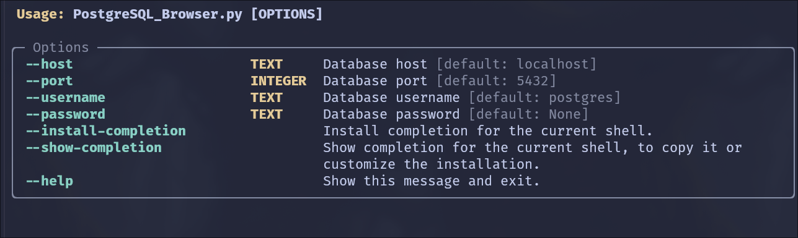
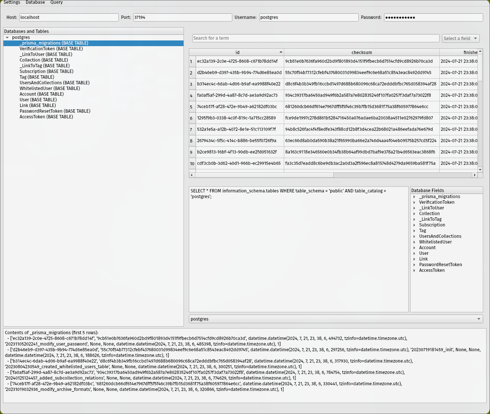

# PostgreSQL-Browser
A PostgreSQL Browser, similar to SQLiteBrowser with far less features (for now).




## Installation

```python
# Append --force to update
pipx install "git+https://github.com/RyanGreenup/PostgreSQL-Browser"
```

## Usage

For testing purposes, consider the attached [docker-compose.yml](./docker-compose.yml) file to spin up a PostgreSQL instance.

```bash
cd $(mktemp -d)
git clone https://github.com/RyanGreenup/PostgreSQL-Browser"
cd PostgreSQL-Browser
docker-compose up -d
docker-compose logs -f
# C-c
```

```python
pg_browser --host localhost --password postgres --username postgres --port 5432
```


